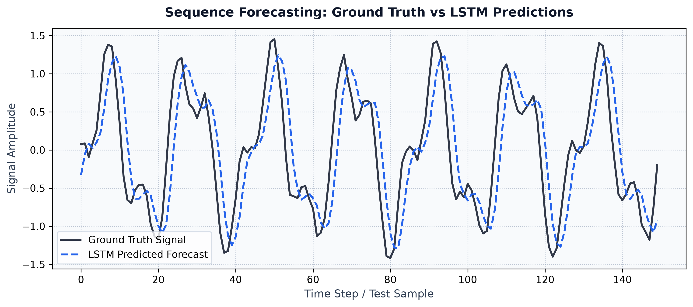
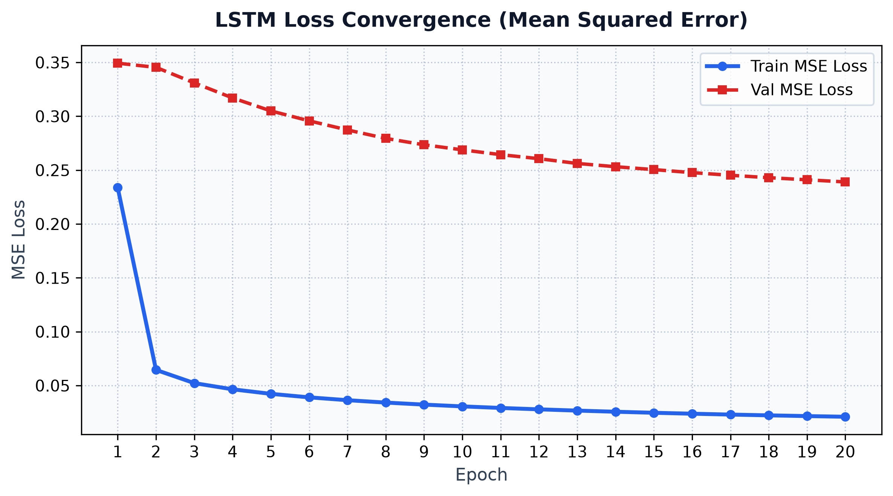

# Long Short-Term Memory (LSTM) RNN from Scratch in NumPy

[](https://www.python.org/)
[](https://numpy.org/)
[](https://docs.pytest.org/)
[](https://github.com/Dan-Tan/Long-Short-Term-Memory-RNN/tree/v0.1.0-legacy)
[](LICENSE)

A 2D Long Short-Term Memory (LSTM) Recurrent Neural Network framework implemented from first principles in NumPy, without relying on PyTorch or TensorFlow for model operations or automatic differentiation.

This project was originally created upon finishing high school as an early programming project to learn Python and understand recurrent neural network mathematics and Backpropagation Through Time (BPTT). The original unedited state is tagged as [`v0.1.0-legacy`](https://github.com/Dan-Tan/Long-Short-Term-Memory-RNN/tree/v0.1.0-legacy) (commit [`771d128`](https://github.com/Dan-Tan/Long-Short-Term-Memory-RNN/commit/771d1287c8052fe2ae764ad802c67fe9bb670b3e)) and preserved in [legacy/original_lstm.py](legacy/original_lstm.py). The repository contains both that legacy script and a modernized refactor with modular layer abstractions, type annotations, unit tests, and fused matrix gate acceleration.

---

## Visualizations

### Sequence Forecast Predictions
Comparing ground truth signals with LSTM sequence predictions:



### Training Loss Convergence


---

## Quickstart & Usage

### 1. Installation
Clone the repository and install dependencies:

```bash
git clone https://github.com/Dan-Tan/Long-Short-Term-Memory-RNN.git
cd Long-Short-Term-Memory-RNN

python3 -m venv .venv
source .venv/bin/activate
pip install -r requirements.txt
```

### 2. Train the LSTM
Run the training pipeline on sequence forecasting:

```bash
python train.py --epochs 10 --batch-size 32 --lr 0.02
```

### 3. Generate High-Resolution Visualizations
Run full 20-epoch training and plot generation:

```bash
python train_full.py --epochs 20 --batch-size 32 --lr 0.03
```

### 4. Run Tests
Run the unit test suite using `pytest`:

```bash
PYTHONPATH=. pytest
```

---

## License
This project is open-source under the [MIT License](LICENSE).
